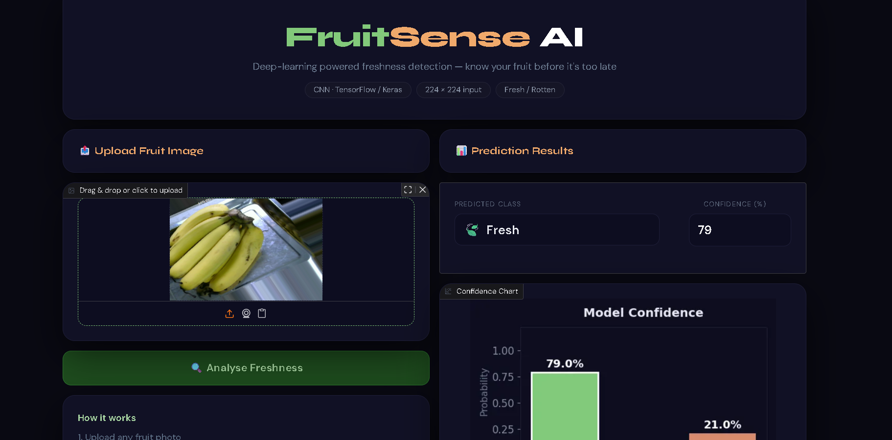
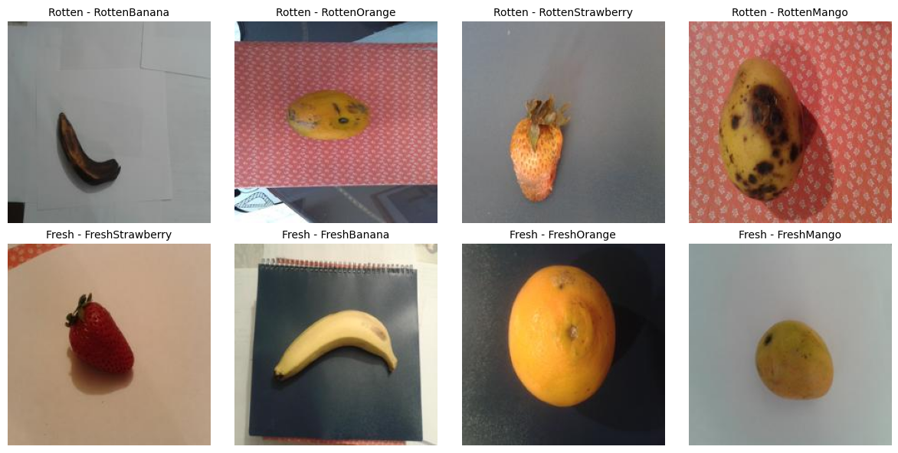
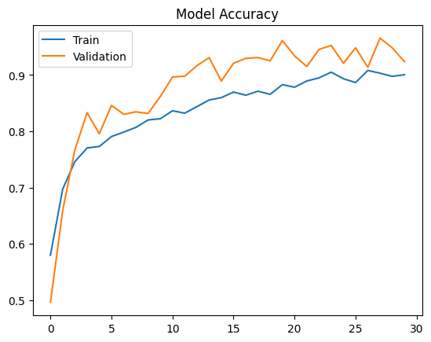
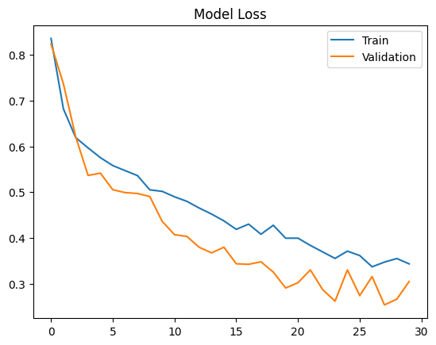
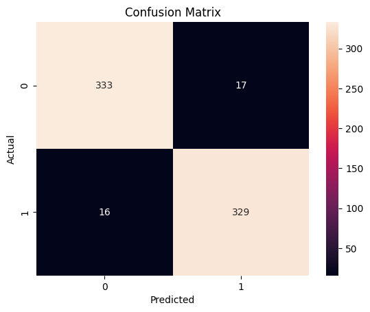

# 🍎 FruitSense AI — Fruit Freshness Classifier

> A deep learning web app that detects whether a fruit is **Fresh** or **Rotten** from a single photo — built with a custom CNN in TensorFlow/Keras and deployed live on HuggingFace Spaces via Gradio.

---

## 📸 App Screenshots



---

## 🚀 Live Demo

Try it directly in your browser — no setup needed:

[](https://tirtha02-fruitsenseai.hf.space/)

**👉 [https://tirtha02-fruitsenseai.hf.space/](https://tirtha02-fruitsenseai.hf.space/)**

---

## 📋 Table of Contents

- [About the Project](#-about-the-project)
- [Model Architecture](#-model-architecture)
- [Dataset](#-dataset)
- [Training Pipeline](#-training-pipeline)
- [Results](#-results)
- [Project Structure](#-project-structure)
- [Getting Started](#-getting-started)
- [How to Run](#-how-to-run)
- [Tech Stack](#-tech-stack)
- [Authors](#-authors)

---

## 🧠 About the Project

**FruitSense AI** is a binary image classification system that distinguishes between fresh and rotten fruits. The project covers the complete deep learning pipeline — from raw dataset preparation and augmentation, through CNN model design and training, to a polished interactive web app deployed live on HuggingFace Spaces.

The model was trained on a multi-fruit dataset containing **Fresh** and **Rotten** categories across banana, mango, orange, and strawberry. A custom CNN architecture with regularisation techniques and early stopping achieves strong generalisation on unseen images.

---

## 🏗 Model Architecture

The model is a custom **Convolutional Neural Network (CNN)** built with TensorFlow/Keras:

```
Input: (150, 150, 3)
│
├── Conv2D(16, 3×3, ReLU) + L2 regularization
├── BatchNormalization
├── MaxPooling2D(2×2)
│
├── Conv2D(32, 3×3, ReLU) + L2 regularization
├── BatchNormalization
├── MaxPooling2D(2×2)
├── Dropout(0.3)
│
├── Conv2D(64, 3×3, ReLU) + L2 regularization
├── BatchNormalization
├── MaxPooling2D(2×2)
├── Dropout(0.3)
│
├── GlobalAveragePooling2D        ← replaces Flatten, reduces overfitting
├── Dense(32, ReLU) + L2 regularization
├── Dropout(0.4)
│
└── Dense(2, Softmax)             ← output: [Fresh, Rotten]
```

**Compiler settings:**
- Optimizer: `Adam (lr = 1e-4)`
- Loss: `Categorical Crossentropy`
- Metric: `Accuracy`

---

## 📦 Dataset

The dataset contains labelled images organised by freshness category and fruit type, covering **banana, mango, orange, and strawberry**:

```
Fruits_Dataset/
├── Fresh/
│   ├── banana/
│   ├── mango/
│   ├── orange/
│   └── strawberry/
└── Rotten/
    ├── banana/
    ├── mango/
    ├── orange/
    └── strawberry/
```
### Sample Images



---

**Dataset split:**

| Split      | Ratio | Purpose                          |
|------------|-------|----------------------------------|
| Train      | 70%   | Model learning + augmentation    |
| Validation | 15%   | Hyperparameter tuning, early stop|
| Test       | 15%   | Final unbiased evaluation        |

Splitting was done per fruit-category combination to maintain class balance across all fruit types.

**Training augmentation applied:**
- Rotation ±25°
- Zoom 30%
- Horizontal flip
- Width & height shift 20%
- Shear 20%

> Validation and test sets use only rescaling (no augmentation) to give a true measure of real-world performance.

---

## 🔧 Training Pipeline

1. **Data loading** — images read from directory using `ImageDataGenerator`, resized to 150×150
2. **Augmentation** — applied on train set only to improve robustness
3. **Normalisation** — pixel values scaled from [0–255] → [0–1]
4. **Training** — up to 30 epochs with `EarlyStopping` (patience=7, monitors `val_loss`, restores best weights)
5. **Evaluation** — confusion matrix, classification report, accuracy/loss curves
6. **Export** — saved as `my_model.keras`

---

## 📊 Results

| Metric              | Score         |
|---------------------|---------------|
| Validation Accuracy | 0.9525      |
| Validation Loss     | 0.2617      |
| Test Accuracy       | 0.9362      |
| Test Loss           | 0.2884      |

**Classification Report (Test Set):**

| Class  | Precision | Recall | F1-Score |
|--------|-----------|--------|----------|
| Fresh  | 0.95   |  0.93   | 0.94     |
| Rotten | 0.93   | 0.95    | 0.94   |

### Training Curves

<!-- Save accuracy and loss plots from the notebook and add them here -->



### Confusion Matrix



---

## 📁 Project Structure

```
FruitImageClassification/
│
├── fruit_freshness_app.py      # Gradio web app — MAIN FILE
├── my_model.keras              # Trained CNN model
│
├── examples/
│   ├── img1.png                # Sample fresh fruit image
│   └── img2.jpg                # Sample rotten fruit image
│
├── requirements.txt            # Python dependencies
└── README.md                   # This file
```

---

## ⚙️ Getting Started

### Prerequisites

- Python 3.9 or higher
- pip

### Installation

1. **Clone the repository**

```bash
git clone https://github.com/YOUR_USERNAME/FruitImageClassification.git
cd FruitImageClassification
```

2. **Create a virtual environment** _(recommended)_

```bash
python -m venv venv
source venv/bin/activate        # macOS / Linux
venv\Scripts\activate           # Windows
```

3. **Install dependencies**

```bash
pip install -r requirements.txt
```

4. **Make sure the model file is present**

The `my_model.keras` file must be in the root directory. To retrain from scratch, run `Project_DL.ipynb` in Google Colab and download the exported model file.

---

## ▶️ How to Run Locally

```bash
python fruit_freshness_app.py
```

Open your browser at **`http://127.0.0.1:7860`**

To generate a temporary public link:

```python
# Change the last line in fruit_freshness_app.py to:
demo.launch(share=True)
```
---

## 🤗 Deployed on HuggingFace Spaces

The app is live at **[https://tirtha02-fruitsenseai.hf.space/](https://tirtha02-fruitsenseai.hf.space/)**

Deployed using **Gradio** as the SDK on HuggingFace Spaces. The following files are required in the Space repository:

| File | Purpose |
|------|---------|
| `app.py` | Gradio app (rename from `fruit_freshness_app.py`) |
| `my_model.keras` | Trained model weights |
| `requirements.txt` | Auto-installed by HuggingFace |
| `examples/` | Sample images shown in the UI |

---

## 🛠 Tech Stack

| Layer             | Technology                        |
|-------------------|-----------------------------------|
| Deep Learning     | TensorFlow 2.x / Keras            |
| Web UI            | Gradio Blocks                     |
| Image Processing  | Pillow, NumPy                     |
| Visualisation     | Matplotlib, Seaborn               |
| Evaluation        | scikit-learn (confusion matrix)   |
| Training ENV      | Google Colab (GPU)                |
| Deployment        | HuggingFace Spaces (Gradio SDK)   |

---

## 👨‍💻 Author
Tirtha

---

## 📄 License

This project is for academic purposes. Feel free to fork and build on it.

---

> _Built as a Deep Learning course project — if you find it useful, leave a ⭐ on GitHub!_
